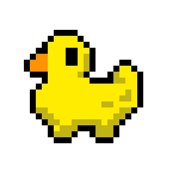

#                                          Pato Filósofo 🦆💭


Bem-vindo ao **Pato Filósofo**, um projeto criado para compartilhar a sabedoria profunda (e às vezes completamente sem sentido) de um pato que contempla a vida, o universo e... o pão! 🥖✨

## O que é o Pato Filósofo?

O **Pato Filósofo** é um blog digital onde um pato fictício oferece reflexões filosóficas e engraçadas sobre a vida, a natureza e, claro, o pão. Cada frase é uma reflexão descontraída que mistura humor e filosofia de uma maneira única. Seja você um filósofo profundo ou apenas um amante de patos, há algo para todos nesse espaço.

## Funcionalidades

- **Frases Filosóficas Engraçadas**: O Pato Filósofo compartilha 20+ frases hilárias e profundas sobre a vida, muitas das quais abordam tópicos como migalhas, pão, lagoas e o significado da existência de um pato.
  
- **Interatividade**: O projeto inclui interações divertidas, como clicar para ver novas frases e explorar o "universo filosófico" de um pato que pensa sobre tudo e todos.

- **Design Simples e Relaxante**: O layout remete a um lago tranquilo, onde você pode navegar enquanto reflete sobre a vida como um pato pensativo.

- **BackGround Interativo, conforme se e dia ou noite.**

## Como Funciona?

1. **Explore as Frases**: O site oferece uma coleção de frases filosóficas do Pato Filósofo, que são exibidas aleatoriamente toda vez que você visita a página.

2. **Inspire-se (ou se Divirta)**: Cada frase é pensada para fazer você rir, refletir ou, no mínimo, pensar: "Esse pato tem razão... ou não?"

3. **Mantenha o Pão em Mente**: Às vezes, tudo que o Pato Filósofo quer mesmo é uma migalha ou um pedaço de pão para refletir enquanto flutua na água.

## Exemplo de Frases

Aqui estão algumas das profundas e engraçadas frases que o Pato Filósofo oferece:

- **"A sabedoria vem com a idade, mas o pão sempre desaparece na hora errada."**
- **"A vida é cheia de perguntas sem resposta, como: por que o pão sempre cai longe?"**
- **"Se o céu está azul e o pão está à vista, então o universo está alinhado."**
- **"Quem disse que o silêncio é de ouro nunca ouviu o som de pão caindo na água."**

## Como Contribuir

1. **Crie novas frases filosóficas**: Sinta-se à vontade para adicionar mais reflexões engraçadas e profundas para o Pato Filósofo. Seja criativo e traga mais sabedoria (ou apenas piadas) para o lago!
   
2. **Melhore o design ou funcionalidades**: Se você tem ideias para tornar o site mais interativo ou visualmente interessante, envie um pull request!

## Como Rodar o Projeto

1. **Clone o repositório**:

```bash
https://github.com/matheushslopesdev/PatoFilosofo.git
